# AWS Certified Solutions Architect Professional (SAP-C02) EXAM NOTES - David Galera, October 2025

- [AWS Certified Solutions Architect Professional (SAP-C02) EXAM NOTES - David Galera, October 2025](#aws-certified-solutions-architect-professional-sap-c02-exam-notes---david-galera-october-2025)
  - [VPC](#vpc)
  - [S3](#s3)
  - [API Gateway](#api-gateway)
  - [Cloudwatch Logs](#cloudwatch-logs)
  - [IAM](#iam)
  - [SSM Patch Manager](#ssm-patch-manager)
  - [OpsWorks](#opsworks)
  - [CloudTrail](#cloudtrail)
  - [DMS](#dms)
  - [Aurora](#aurora)
  - [RDS](#rds)
  - [KDS](#kds)
  - [Redshift](#redshift)
  - [Organizations](#organizations)
  - [EC2](#ec2)
  - [EBS](#ebs)
  - [ELB](#elb)
  - [SQS](#sqs)
  - [KMS](#kms)
  - [Security Hub](#security-hub)
  - [DataSync](#datasync)
  - [Storage Gateway](#storage-gateway)
  - [FSx](#fsx)
  - [Route 53](#route-53)
  - [CloudFront](#cloudfront)
  - [Global Accelerator](#global-accelerator)
  - [GuardDuty](#guardduty)
  - [Inspector](#inspector)
  - [WAF](#waf)
  - [Secrets Manager](#secrets-manager)
  - [SnowMobile](#snowmobile)
  - [Storage](#storage)
  - [Migration Strategies](#migration-strategies)

## VPC

DX + s2s VPN: **Dedicated and encrypted connection**
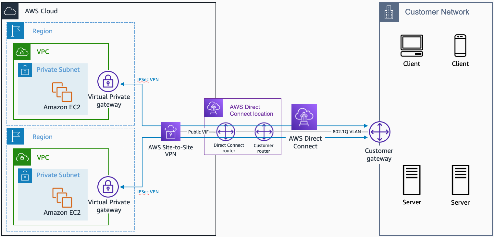

VPC Interface endpoint policies:
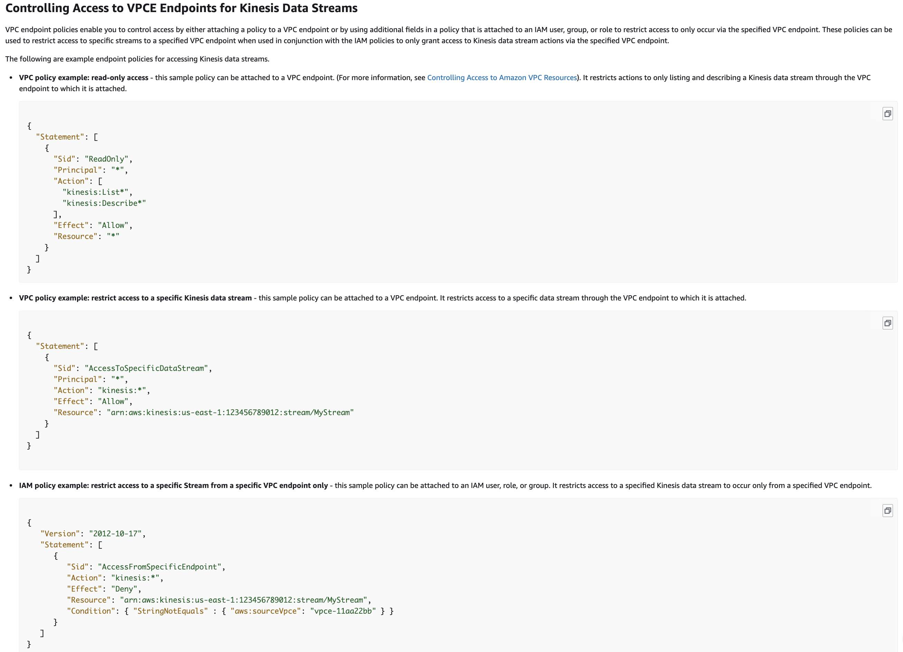

S3 Bucket policies for GW endpoints:
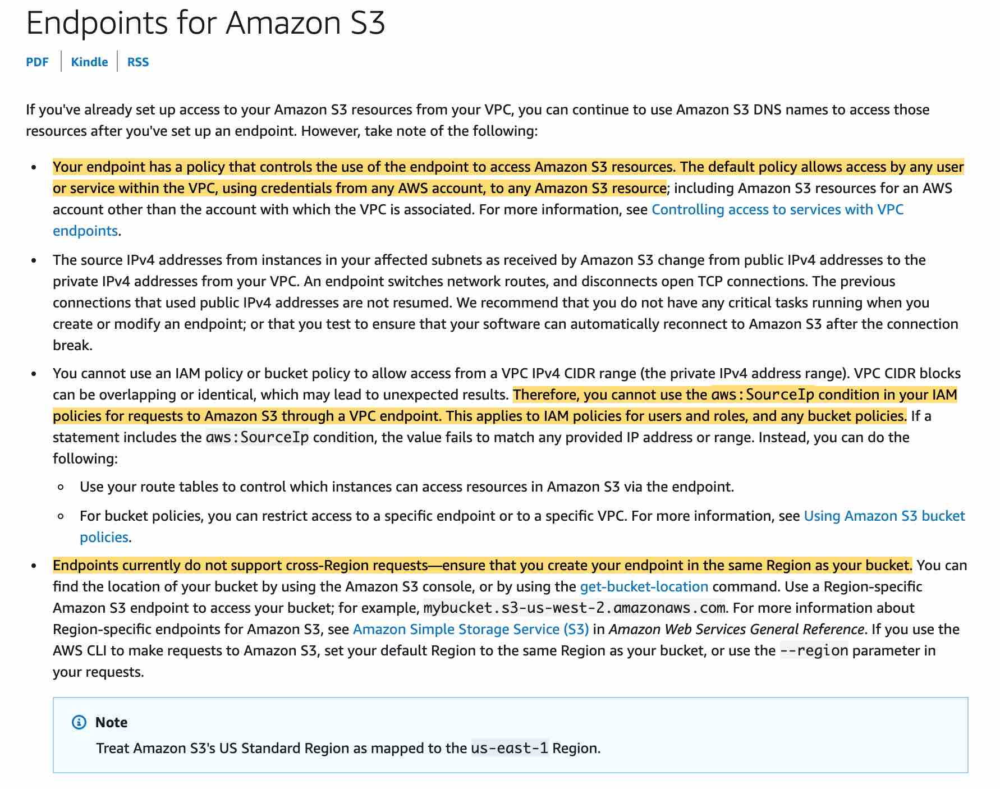

SGs:
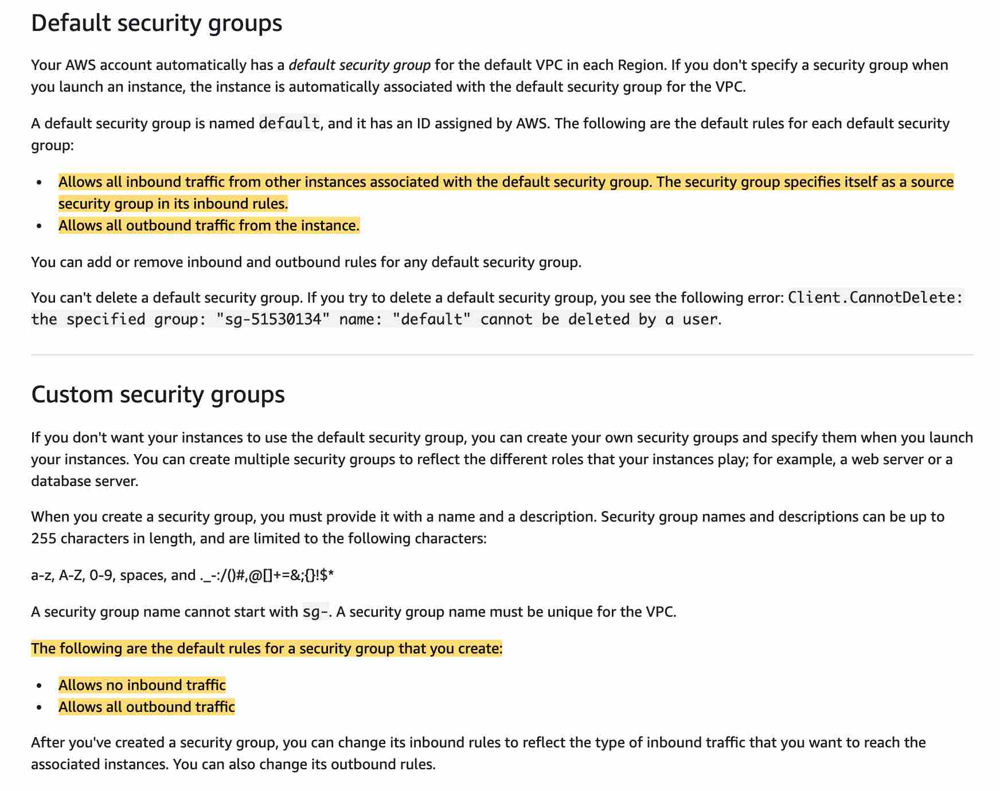

DX connection VIFs:
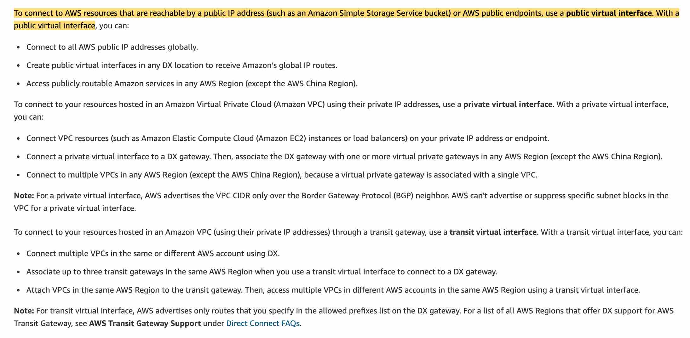
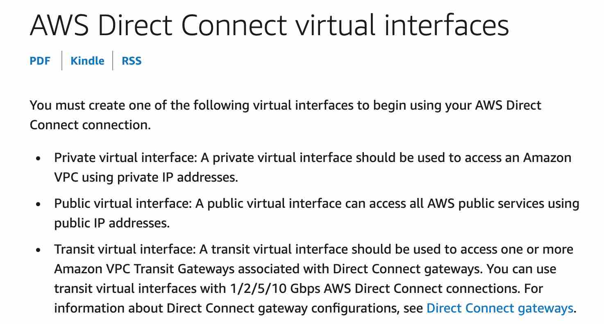

Shared Services VPC:
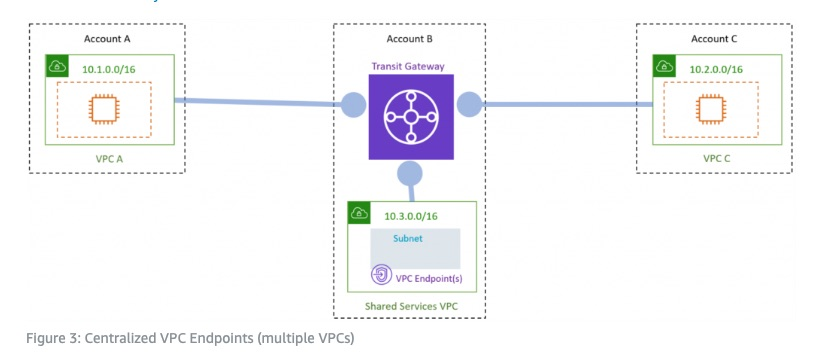

VPN 3 flavours: hardware only, software only and a mix of hardware/software. Hardware only VPNs include both the AWS managed **AWS Site-to-Site VPN** solution and the **AWS VPN CloudHub**. You can also create a VPN connection to your remote network by using an **Amazon EC2 instance in your VPC that's running a third party software VPN appliance**.
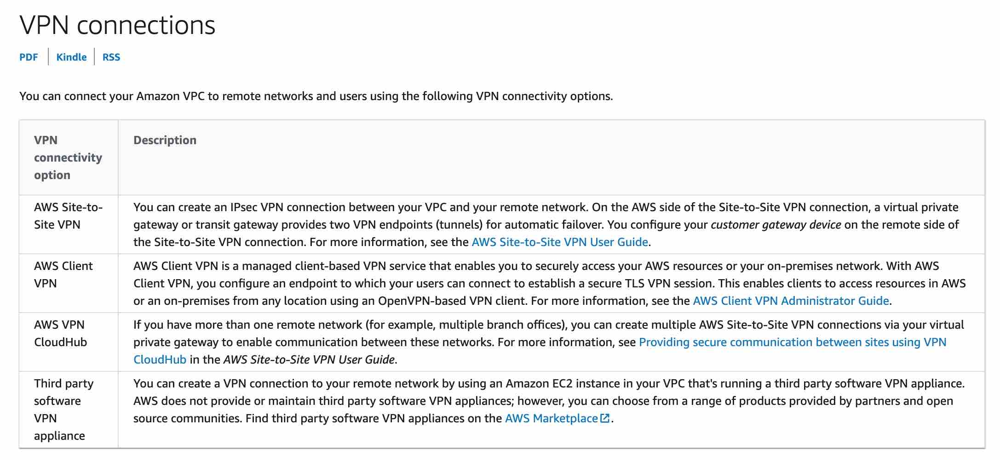

Transit VPC:
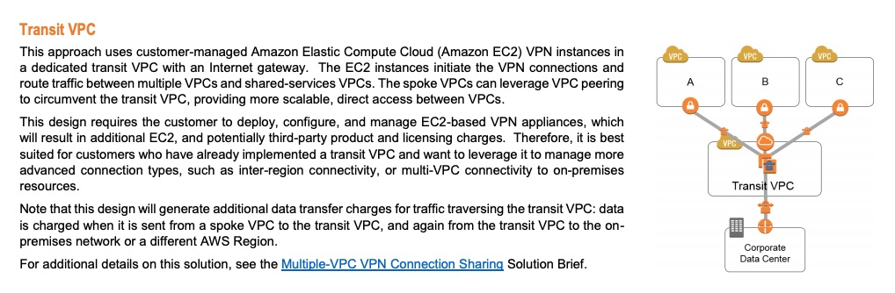

The **VPN CloudHub** operates on a simple hub-and-spoke model that you can use with or without a VPC.
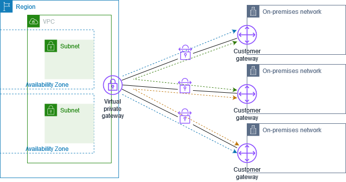

**PrivateLink**: PrivateLink uses ENIs within the client VPC so that there are no IP address conflicts with the service provider. You can access PrivateLink endpoints over VPC peering, VPN, and AWS Direct Connect connections. PrivateLink supports VPC peering, which makes it possible for customers to privately connect to a service, even if that service's endpoint resides in a different Amazon VPC that is connected using VPC peering.

NAT GW unsolicited inbound connections, you can run the query using only the first 2 octets (dstAddr=VPC CIDR, srcAddr=Inbound IP):
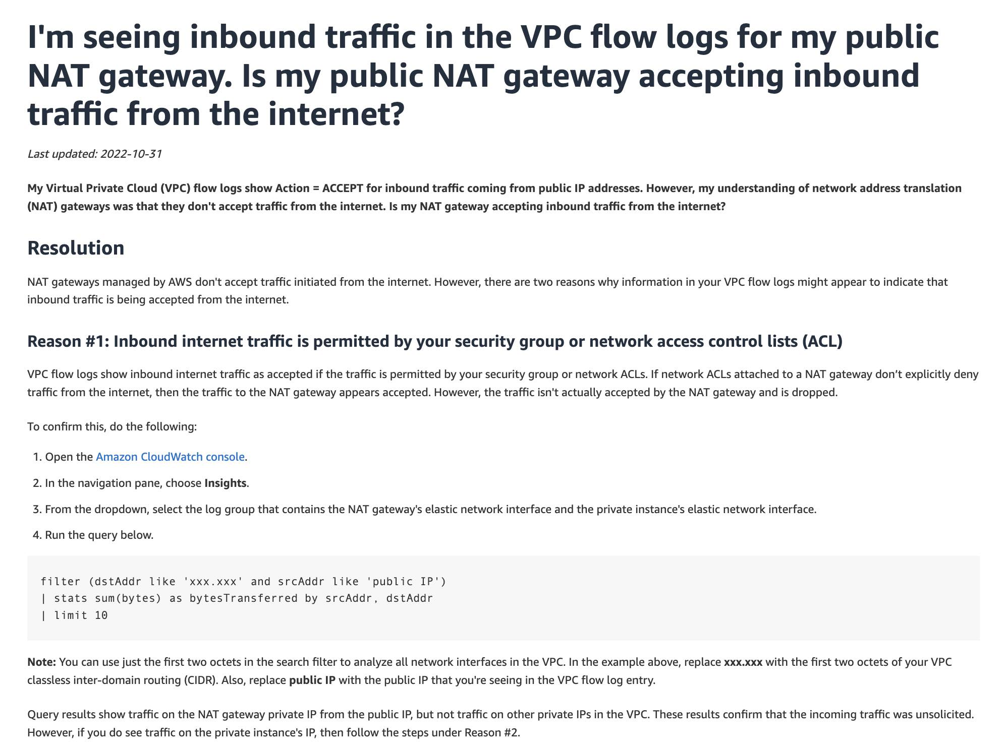

**Private hosted zones** accept DNS queries only from a VPC DNS server. The IP address of the VPC DNS server is the reserved IP address at the base of the VPC IPv4 network range plus two. Enabling DNS resolution allows you to use the VPC DNS server as a Resolver for performing DNS resolution. Keep this option disabled if you're using a custom DNS server in the DHCP Options set, and you're not using a private hosted zone.

**Outbound endpoint on Route 53 Resolver**: To resolve DNS queries for any resources in the on-premises network from the AWS VPC, you can create an outbound endpoint on Route 53 Resolver and then Route 53 Resolver can conditionally forward queries to resolvers on the on-premises network via this endpoint. To **conditionally forward queries**, you need to create **Resolver rules** that specify the domain names for the DNS queries that you want to forward (such as example.com) and the **IP addresses of the DNS resolvers on the on-premises network** that you want to forward the queries to.

## S3

**Byte Range Fetch**:
You can use concurrent connections to Amazon S3 to fetch different byte ranges from within the same object. This helps you achieve higher aggregate throughput versus a single whole-object request.

S3 Select ScanRange.

When data is transfered out to Cloudfront, its **free**.

**S3 standard IA has a minimum storage duration charge of 30 days** thereby making it costlier than using S3 Standard storage class for the given scenario because the data would be moved to Glacier via a Lifecycle policy immediately.
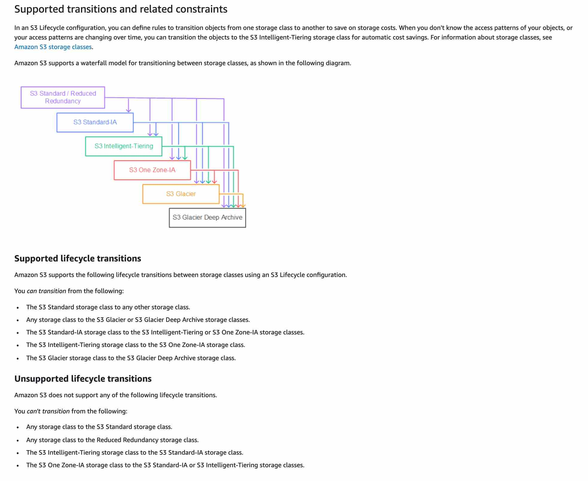
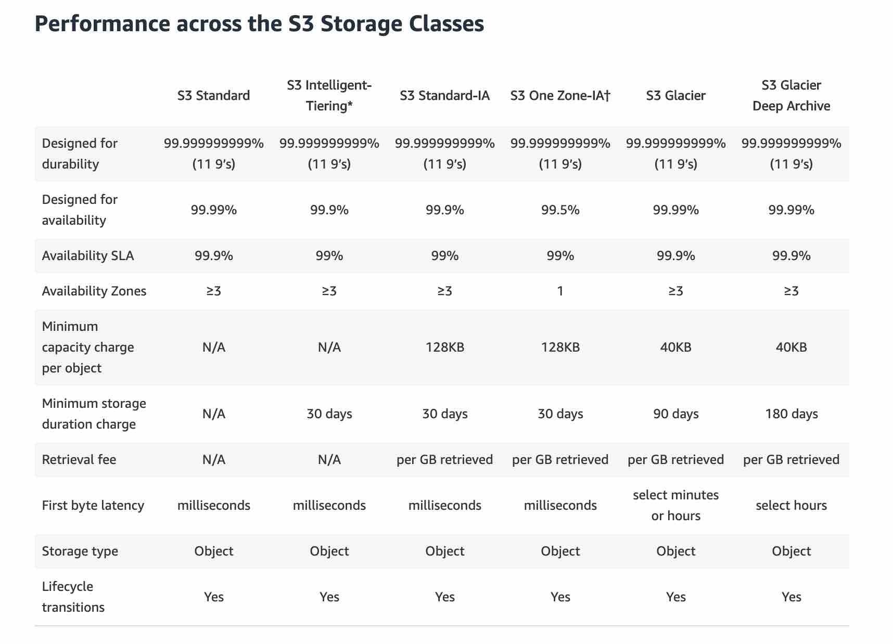

## API Gateway

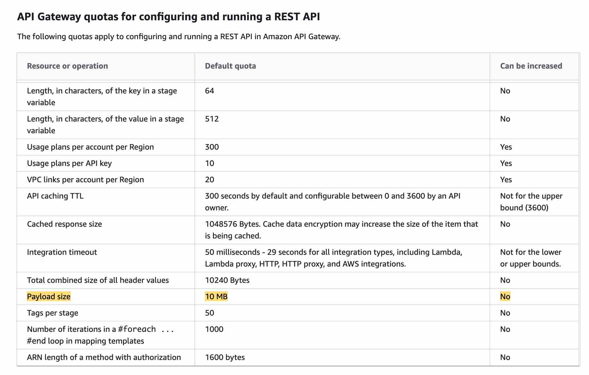

**Usage Plans** can be defined at the API or API method level. When request submissions exceed the steady-state request rate and **burst limits**, API Gateway begins to throttle requests.

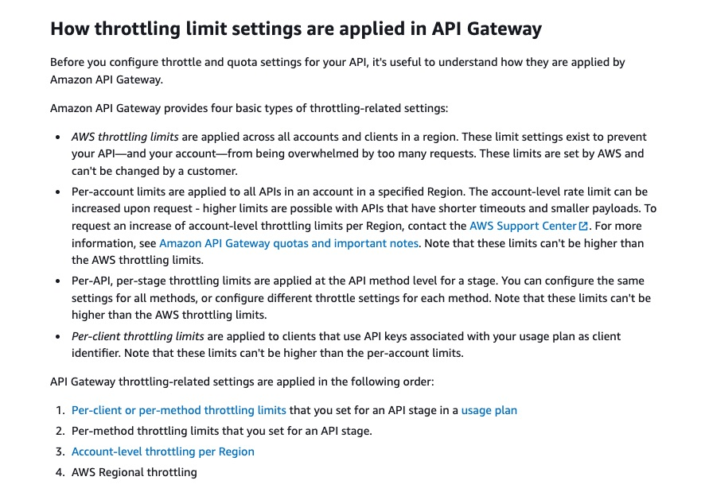

## Cloudwatch Logs

**CWLogs Subscription Filter**: You can use a subscription filter with **Kinesis Streams**, **Lambda**, or **Kinesis Data Firehose**. Logs that are sent to a receiving service through a subscription filter are **Base64 encoded and compressed with the gzip format**.

## IAM

**IAM Access Analyzer** analyzes CloudTrail logs to determine whether external access is granted. Both IAM Access Analyzer and Macie findings can be reported in Security Hub. Security Hub has integration with Organizations, so you can use one single Security Hub dashboard to monitor for both security issues in one place.

**Permission Boundaries**: You can attach permissions boundaries only to a **user** or **role**, **not a group**.

## SSM Patch Manager

You can use Patch Manager to apply patches for both operating systems and applications. (On Windows Server, application support is limited to updates for Microsoft applications). Patch Manager uses patch baselines, which include rules for auto-approving patches within days of their release, as well as a list of approved and rejected patches. You can install patches individually or to large groups of instances by using Amazon EC2 tags.

Systems Manager supports an SSM document for Patch Manager, `AWS-RunPatchBaseline`, which performs patching operations on instances for both security-related and other types of updates. When the document is run, it uses the patch baseline currently specified as the "default" for an operating system type.

The `AWS-ApplyPatchBaseline` SSM document supports patching on **Windows instances only and doesn't support Linux instances**. For applying patch baselines to both Windows Server and Linux instances, the recommended SSM document is `AWS-RunPatchBaseline`.

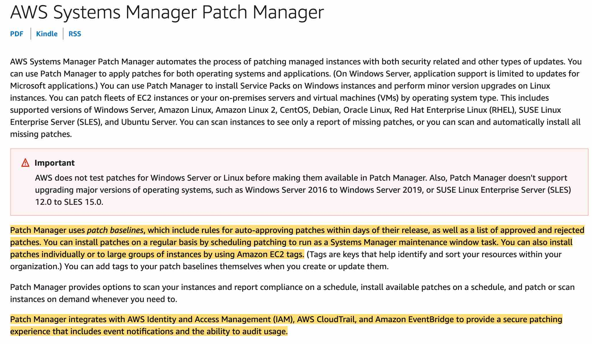

## OpsWorks

AWS OpsWorks is a configuration management service that provides managed instances of Chef and Puppet. Chef and Puppet are automation platforms that allow you to use code to automate the configurations of your servers. OpsWorks lets you use Chef and Puppet to automate how servers are configured, deployed, and managed across your Amazon EC2 instances or on-premises compute environments. **You cannot use OpsWorks for automatic patch management**.

## CloudTrail

**AWS CloudTrail data events** capture the last 90 days of bucket-level events (for example, `PutBucketPolicy` and `DeleteBucketPolicy`), and you can enable object-level logging. These logs use a JSON format. After you enable object-level logging with data events, review the logs to find the IP addresses used with each upload to your bucket. It might take a few hours for AWS CloudTrail to start creating logs.

## DMS

RDS to Redshift: The Amazon Redshift cluster must be in the same AWS account and the same AWS Region as the DMS replication instance. During a database migration to Amazon Redshift, AWS DMS first moves data to an Amazon S3 bucket. When the files reside in an Amazon S3 bucket, AWS DMS then transfers them to the proper tables in the Amazon Redshift data warehouse. AWS DMS creates the S3 bucket in the same AWS Region as the Amazon Redshift database.

You can use **AWS DMS data validation** to ensure that your data has migrated accurately from the source to the target. DMS compares the source and target records and then reports any mismatches. In addition, for a CDC-enabled task, AWS DMS compares the incremental changes and reports any mismatches. As part of data validation, DMS compares each row in the source with its corresponding row at the target and verifies that those rows contain the same data. **For this comparison, DMS issues appropriate queries to retrieve the data**. These queries consume additional resources at the source and the target as well as additional network resources.

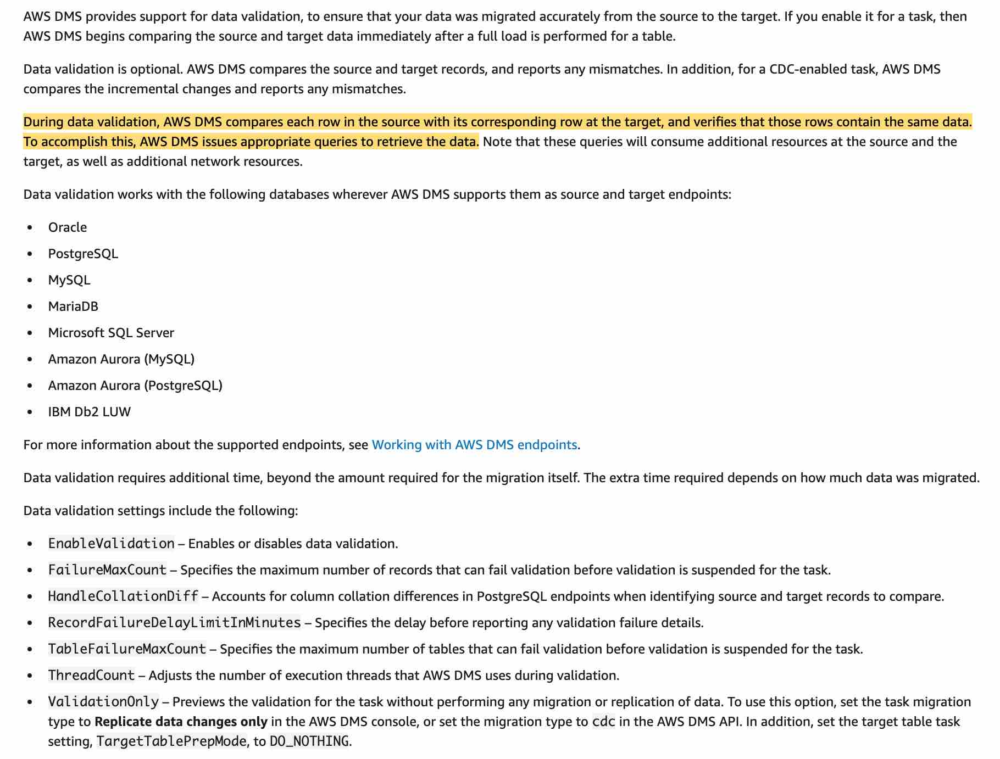

Premigration assessment: A premigration assessment evaluates specified components of a database migration task to help identify any problems that might prevent a migration task from running as expected. This assessment gives you a chance to identify issues before you run a new or modified task. You can then fix problems before they occur while running the migration task itself. This can avoid delays in completing a given database migration needed to repair data and your database environment.

## Aurora

**Aurora Auto Scaling** dynamically adjusts the number of Aurora **Replicas** provisioned for an Aurora DB cluster using **single-master replication**.

You define and apply a **scaling policy** to an Aurora DB cluster. The scaling policy defines the minimum and maximum number of Aurora Replicas that Aurora Auto Scaling can manage. Based on the policy, Aurora Auto Scaling adjusts the number of Aurora Replicas up or down in response to actual workloads, determined by using Amazon CloudWatch metrics and target values.

**Aurora Auto Scaling is possible for Aurora replicas and not for Aurora writer instances**. **Multi-master Aurora Cluster** architecture is needed if multiple writers are needed for any use case.

## RDS

**Disaster Recovery**: In addition to using Read Replicas to reduce the load on your source DB instance, you can also use Read Replicas to implement a DR solution for your production DB environment. If the source DB instance fails, you can promote your Read Replica to a standalone source server. Read Replicas can also be created in a different Region than the source database. Using a **cross-Region Read Replica** can help ensure that you get back up and running if you experience a regional availability issue.

**Automated Backups**: The automated backup feature of Amazon RDS enables point-in-time recovery for your database instance. Amazon RDS will backup your database and transaction logs and store both for a user-specified retention period. If it’s a Multi-AZ configuration, backups occur on the standby to reduce I/O impact on the primary. Amazon RDS supports **single Region** or **cross-Region** automated backups.

**Database cloning** is only available for Aurora and not for RDS.

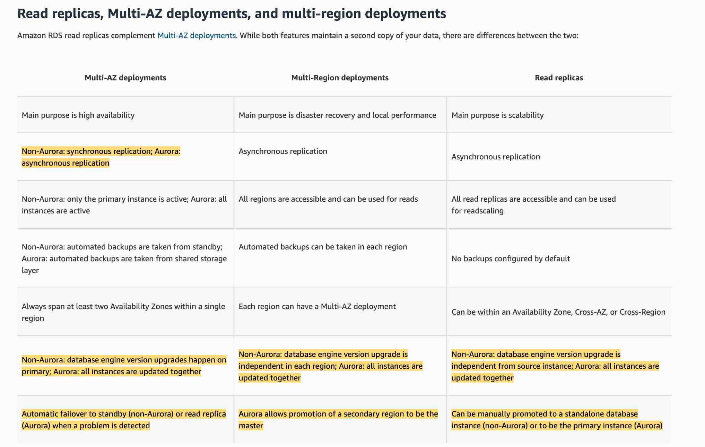

## KDS

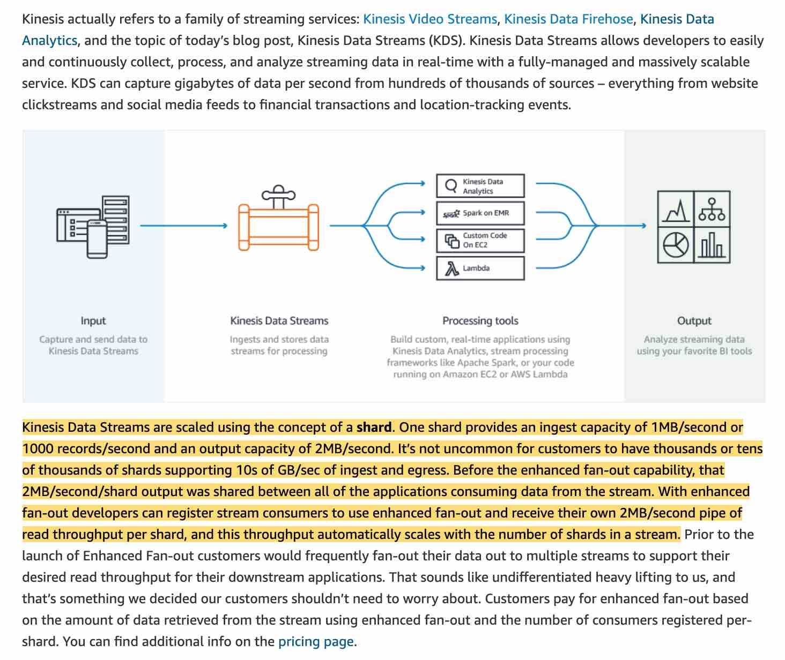

## Redshift

Using Amazon **Redshift Spectrum**, you can efficiently query and retrieve structured and semistructured data from files in Amazon S3 without having to load the data into Amazon Redshift tables. Amazon Redshift Spectrum resides on dedicated Amazon Redshift servers that are independent of your cluster. Redshift Spectrum pushes many compute-intensive tasks, such as predicate filtering and aggregation, down to the Redshift Spectrum layer. Thus, Redshift Spectrum queries use less of your cluster's processing capacity than other queries.

## Organizations

SCPs:

- An **SCP** cannot be overridden, even when users within the account have **administrative rights**
- SCPs **do not affect service-linked roles**

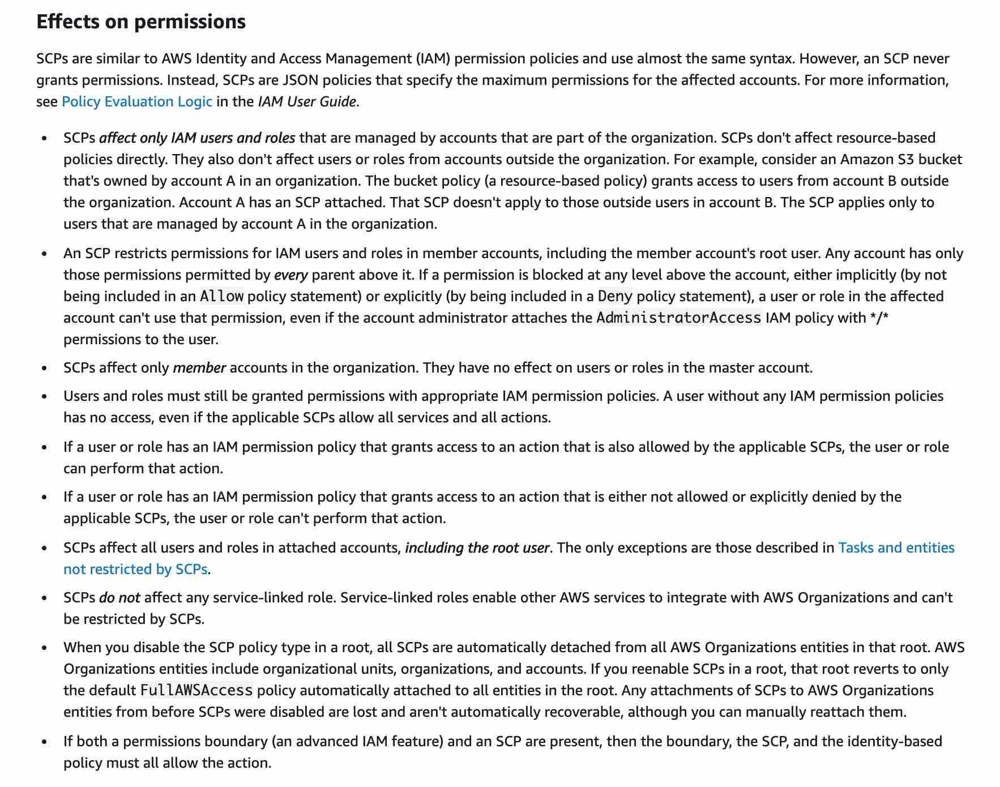

Set a budget alert and move the exceeding budget account to a restricted OU
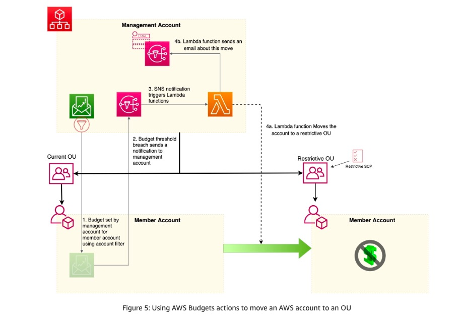

GuardDuty: When you use GuardDuty with an AWS Organizations organization, you can designate any account within the organization to be the GuardDuty delegated administrator. **Only** the organization **management account can designate GuardDuty delegated administrators**. An account that is designated as a delegated administrator becomes a **GuardDuty administrator account**, has GuardDuty automatically enabled in the designated Region and is granted permission to enable and **manage GuardDuty for all accounts in the organization within that Region**. The other accounts in the organization can be viewed and added as GuardDuty member accounts associated with the delegated administrator account.

## EC2

Debugging EC2 instances before they are terminated by ASG
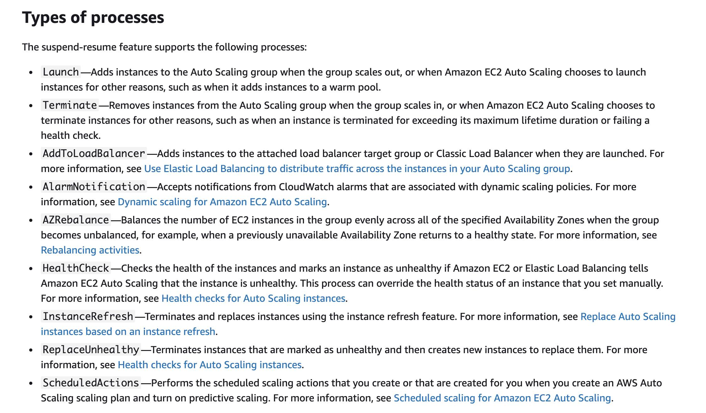
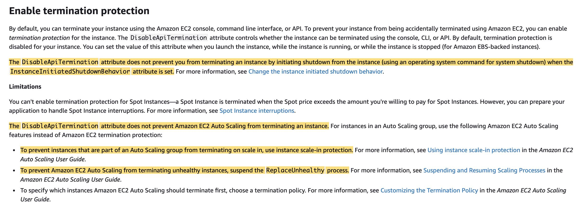

## EBS

General purpose: Baseline performance scales linearly at **3 IOPS per GiB of volume size**

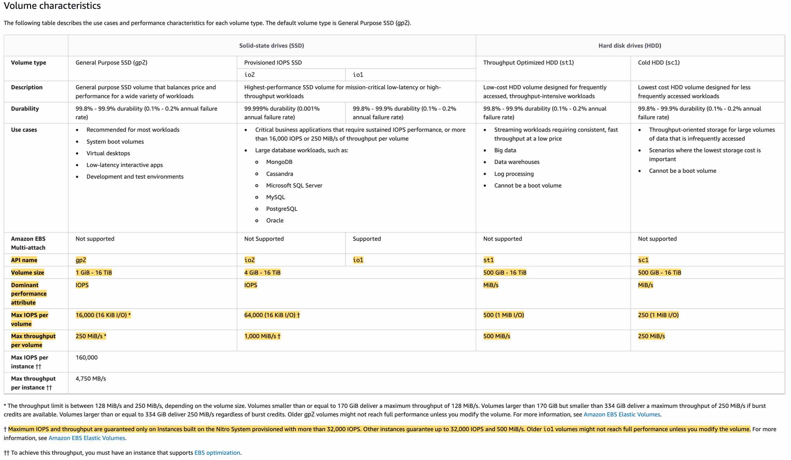

Provisioned IOPS: You can provision from 100 IOPS up to 64,000 IOPS per volume on Instances built on the Nitro System and up to 32,000 on other instances. The maximum ratio of provisioned IOPS to requested volume size (in GiB) is 50:1 for io1 volumes, and 500:1 for io2 volumes.
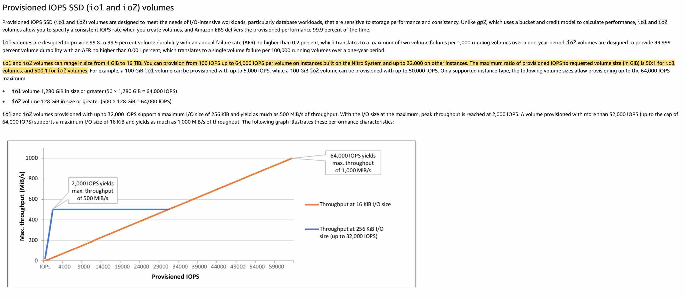

## ELB

**NLB does not support Least Outstanding Requests routing algorithm**. AWS suggests using the Least Outstanding Requests with an ALB when the requests for your application vary in complexity or your targets vary in processing capability.

For TCP traffic, the NLB selects a target using a **flow hash algorithm** based on the protocol, source IP address, source port, destination IP address, destination port, and TCP sequence number. The TCP connections from a client have different source ports and sequence numbers and can be routed to different targets. Each TCP connection is routed to a single target for the life of the connection.

For UDP traffic, the NLB selects a target using a **flow hash algorithm** based on the protocol, source IP address, source port, destination IP address, and destination port. A UDP flow has the same source and destination, so it is consistently routed to a single target throughout its lifetime. Different UDP flows have different source IP addresses and ports, so they can be routed to different targets.

## SQS

You can use **message timers** to set an initial invisibility period for a message added to a queue. So, if you send a message with a 60-second timer, the message isn't visible to consumers for its first 60 seconds in the queue. **The default (minimum) delay for a message is 0 seconds. The maximum is 15 minutes.**

**Delay queues** let you postpone the delivery of **all** new messages to a queue for several seconds. 0 - 15 minutes.

## KMS

`GenerateDataKey` API call for client side encryption:
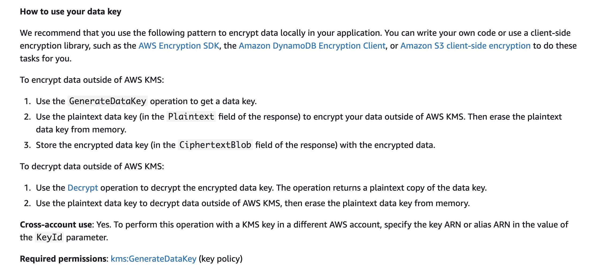

## Security Hub

You cannot use AWS Security Hub to manage AWS WAF rules across accounts in the organization, rather you need to use **AWS Firewall Manager** to accomplish this.

## DataSync

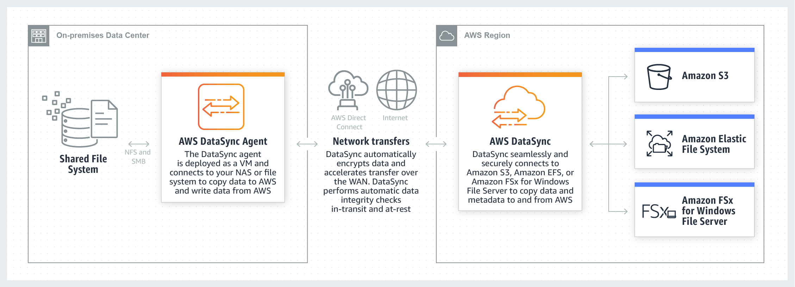

DataSync copies data over the internet or AWS Direct Connect.

In most situations, **you deploy the agent as a virtual machine in the same local network as your source storage**. This approach minimizes network overhead associated with transferring data by using network protocols such as Network File System (NFS) and Server Message Block (SMB) or when accessing your object storage that's compatible with the Amazon S3 API. This setup is common regardless of the endpoint type you use to connect your agent to AWS.

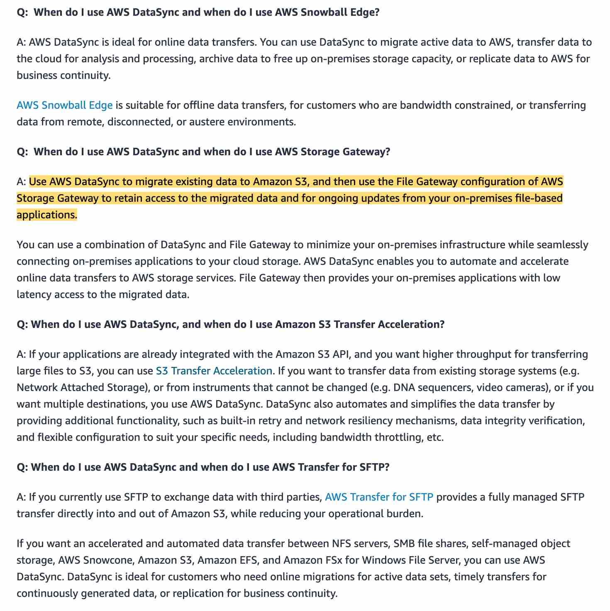

## Storage Gateway

S3 File GW: Storage Gateway updates the file share cache automatically when you write files to the cache locally using the file share. However, **Storage Gateway doesn't automatically update the cache when you upload a file directly to Amazon S3**. When you do this, you must perform a `RefreshCache` operation to see the changes on the file share. If you have more than one file share, then you must run the `RefreshCache` operation on each file share.

## FSx

In a Multi-AZ deployment, Amazon FSx automatically provisions and maintains a standby file server in a different Availability Zone. Any changes written to disk in your file system are synchronously replicated across Availability Zones to the standby. If there is planned file system maintenance or unplanned service disruption, Amazon FSx automatically fails over to the secondary file server, allowing you to continue accessing your data without manual intervention.

You can test the **failover** of your Multi-AZ file system by **modifying its throughput capacity**. When you modify your file system's throughput capacity, Amazon FSx switches out the file system's file server.

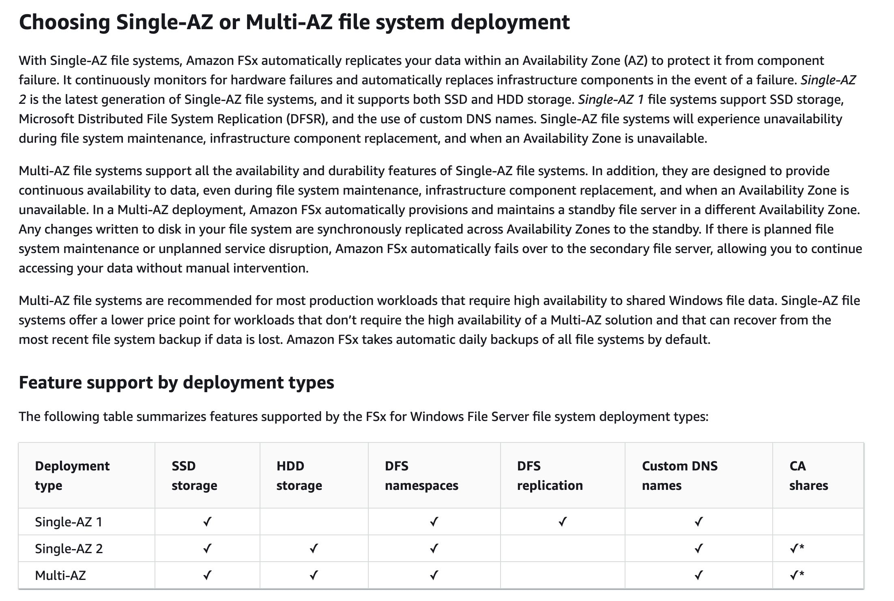

## Route 53

Route 53 DNS requests and subsequent application traffic routed through CloudFront are inspected inline. Always-on monitoring, anomaly detection, and mitigation against common infrastructure DDoS attacks such as SYN/ACK floods, UDP floods, and **reflection attacks are built into both Route 53 and CloudFront**.

Route 53 is also designed to withstand DNS query floods, which are real DNS requests that can continue for hours and attempt to exhaust DNS server resources. Route 53 uses shuffle sharding and anycast striping to spread DNS traffic across edge locations and help protect the availability of the service.

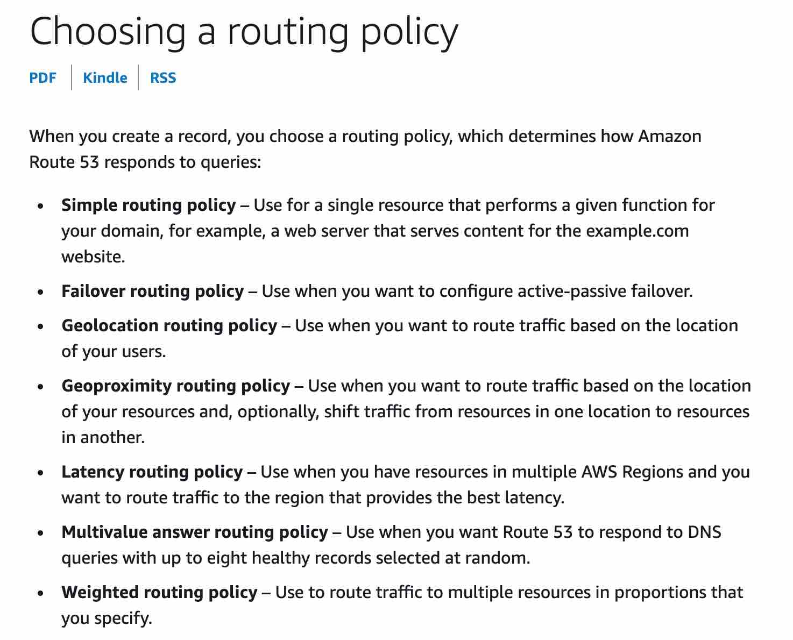

## CloudFront

To avoid the **307 Temporary Redirect response**, send requests only to the Regional endpoint in the same Region as your S3 bucket. CloudFront forwards requests to the default S3 endpoint ( s3.amazonaws.com). The default S3 endpoint is in the us-east-1 Region. If you must access Amazon S3 within the first 24 hours of creating the bucket, you can change the origin domain name of the distribution. The domain name must include the Regional endpoint of the bucket. For example, if the bucket is in us-west-2, you can change the origin domain name from `awsexamplebucketname.s3.amazonaws.com` to `awsexamplebucket.s3.us-west-2.amazonaws.com`.

## Global Accelerator

AWS Global Accelerator is a service that improves the availability and performance of your applications with local or global users. It provides **2 static IP addresses that act as a fixed entry point to your application endpoints in a single or multiple AWS Regions**, such as your Application Load Balancers, Network Load Balancers or Amazon EC2 instances.

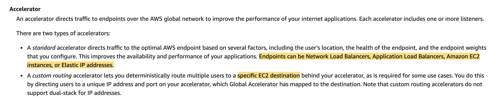

## GuardDuty

GuardDuty is an intelligent threat detection service that continuously monitors your **AWS accounts, Amazon Elastic Compute Cloud (EC2) instances, Amazon Elastic Kubernetes Service (EKS) clusters, and data stored in Amazon Simple Storage Service (S3)** for malicious activity without the use of security software or agents. GuardDuty generates detailed security findings that can be used for security visibility and assisting in remediation. GuardDuty can monitor reconnaissance activities by an attacker such as unusual API activity, intra-VPC port scanning, unusual patterns of failed login requests, or unblocked port probing from a known bad IP.

## Inspector

Amazon Inspector is an automated vulnerability management service that continually scans Amazon Elastic Compute Cloud (EC2) and container workloads for software vulnerabilities and unintended network exposure.

## WAF

- Amazon CloudFront distribution
- Amazon API Gateway REST API
- Application Load Balancer
- AWS AppSync GraphQL API
- Amazon Cognito user pool

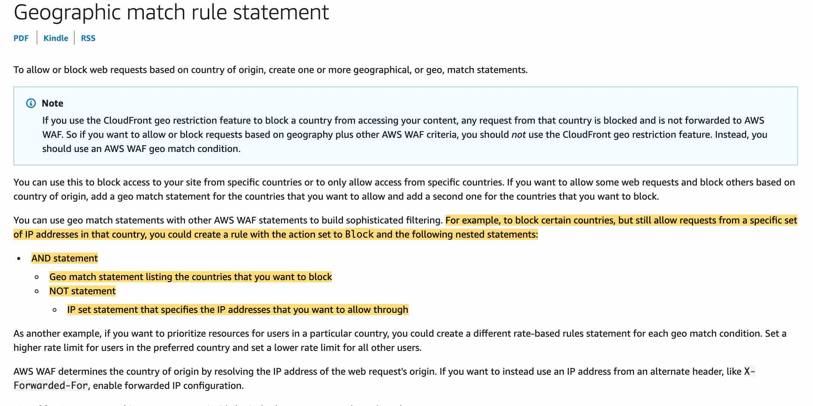

The logging destinations that you can choose from for your AWS WAF logs are:

- CloudWatch Logs
- S3
- Kinesis Data Firehose

## Secrets Manager

Secrets Manager can't rotate secrets for AWS services running in Amazon VPC private subnets because these subnets don't have internet access. To rotate the keys successfully you need to configure an Amazon VPC interface endpoint to access your Secrets Manager Lambda function and private Amazon Relational Database Service (Amazon RDS) instance.

Steps that need to be followed:

1. Create security groups for the Secrets Manager VPC endpoint, Amazon RDS instance, and the Lambda rotation function
2. Add rules to Amazon VPC endpoint and Amazon RDS instance security groups
3. Attach security groups to AWS resources
4. Create an Amazon VPC interface endpoint for the **Secrets Manager service** and associate it with a security group
5. Verify that the Secrets Manager can rotate the secret

## SnowMobile

For datasets > 10 PB

## Storage

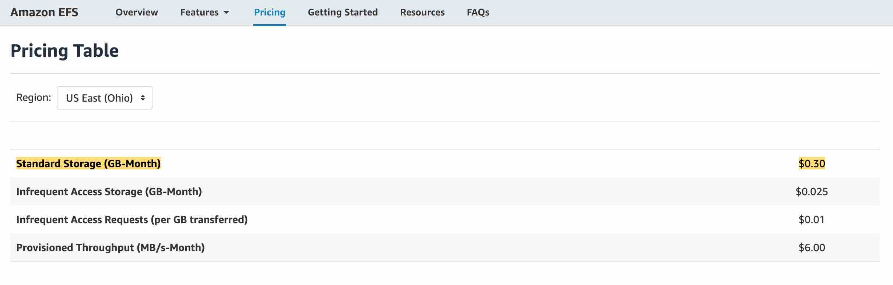
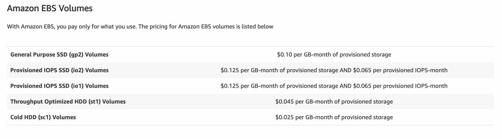
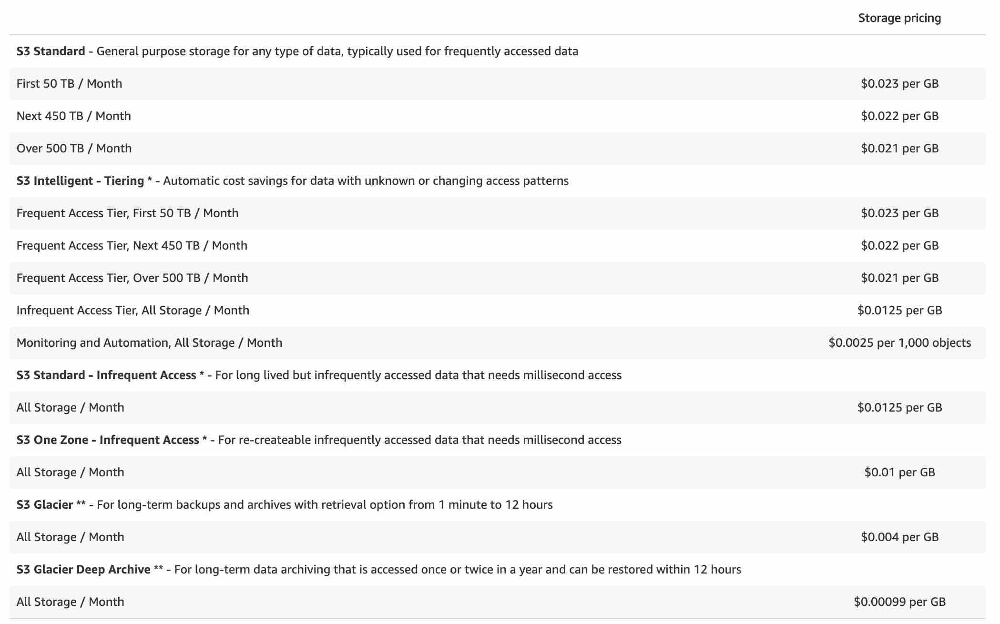

## Migration Strategies

**Replatforming** is a migration strategy where you don't change the core architecture but leverage some cloud optimizations.
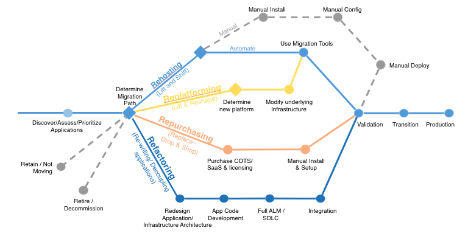
